# README

我认为**接手我的论文（后续完全不需要我的参与），自己去做一作，是可以接受的**。当时同意让出署名，是因为这篇论文对我来说并不重要，毕竟我是要转开发的，把时间放在论文上不如把时间放在开发项目上。**让我最生气的，不是署名顺序，而是即使让出一作，依旧被各种恶心**：

- **即使我抓紧时间干活，仍然会因为zl、cx的拖延和打扰，迟迟不能真正摆脱这篇论文，导致我的暑假严重缩水，有比较长的一段时间，学也没学到，玩也没玩到。**如果没有这两个人，我的简历上可以多一个项目。
- **即使我干活了，还要被老师用很差的态度对待：本人提供后续实验结果后仍被挑剔没有直接在overloaf里改**（我是真的后悔给它们提供结果，就应该让它们气死在半路上）**；会议迟到非常久，甚至可以迟到一小时以上，一点也不尊重别人的时间；没有明确让我干某件事情，就默认我要干这件事情，没主动干活就会生气**（我很后悔当时没有拉黑它们，发挥得太差了）。
- **cx水平这么差，居然认为自己有能力接手别人的论文，真有自信啊。我还是对能力差的人太缺乏想象力了。**

即便如此，我依然没有打算公开这件事。
更让我愤怒的，是——**他们在没有征得我同意的情况下，将那篇论文直接替代毕业设计。**
更讽刺的是，在那之前我还没有拉黑他们，他们完全有机会提前沟通。

给到各位本科生/研究生/博士生的建议是，假如你毕业了，有成果没中，但也不想管了，可以让别人接手，但是一旦交接完别人还来烦你，就要马上拉黑！不管导师或对方多“有威严”，只要没有实实在在的好处，就要马上拉黑它！

而且，**毕业前那么多时间不管我的论文，快毕业了来问我论文还准备不准备投，是何意味？**

**欢迎各位学弟学妹选择其他导师，当然如果你选择了kwz，后续仍有可能被zl指导，可能要给cx做牛马。**

**也存在这样一种可能，这样的恶心事情属于小概率事件。但是，希望大家不要抱有侥幸心理。**

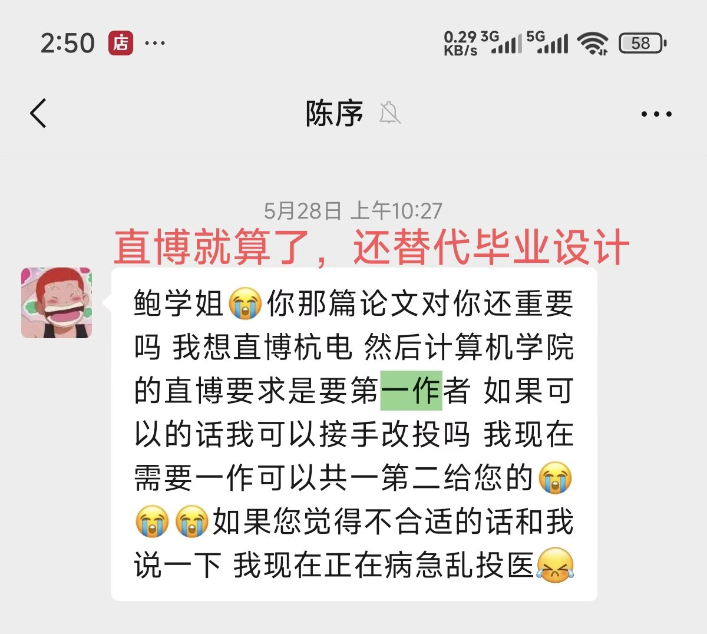

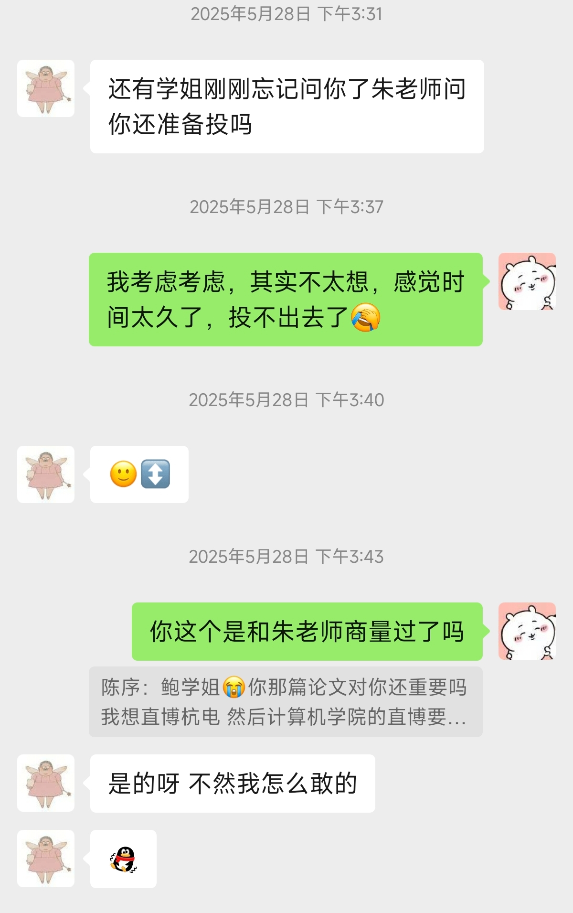

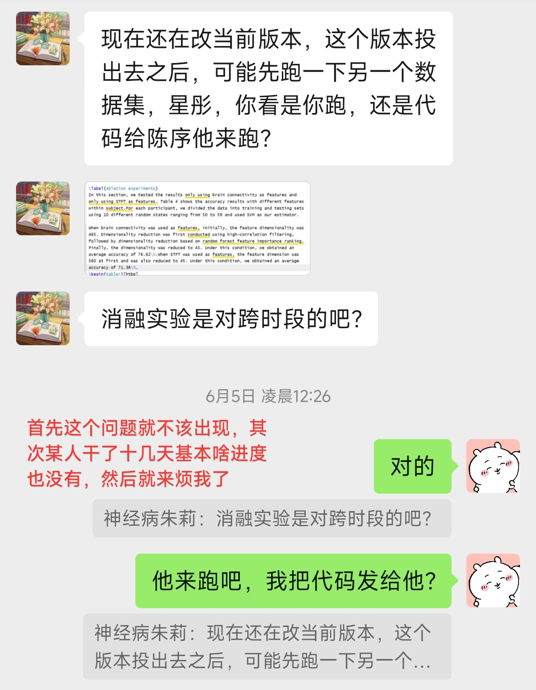

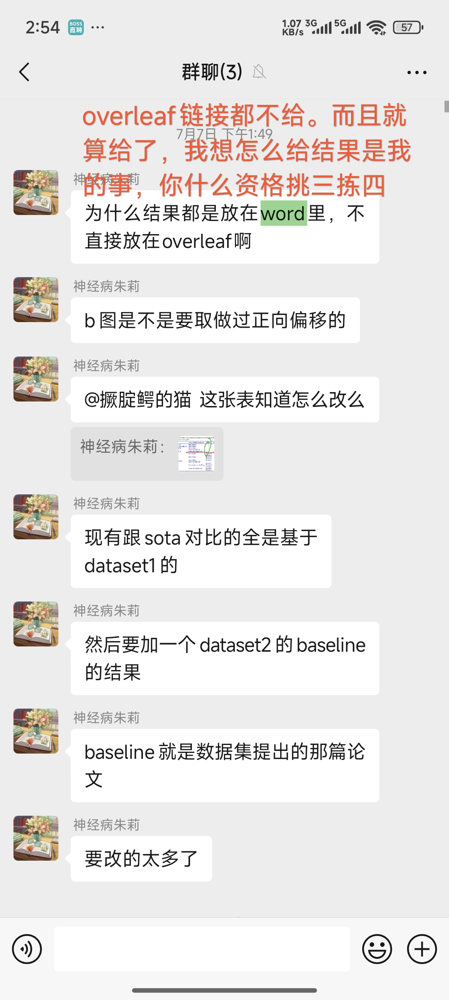

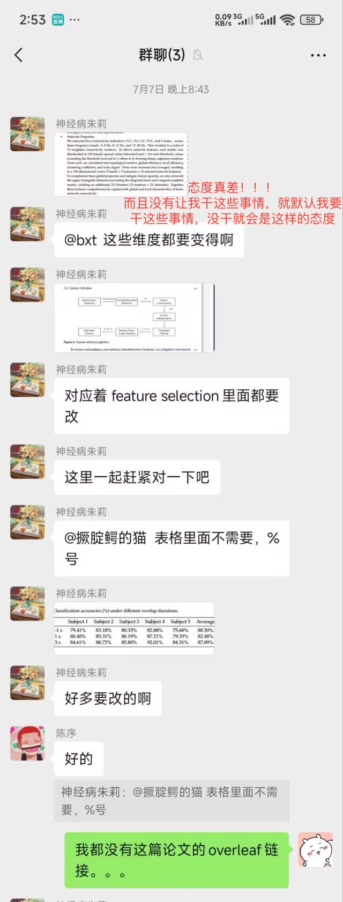

也可以理解吧，想我放弃一作的时候，希望论文对我来说是不重要的。我不干活，就希望论文对我来说是重要的。

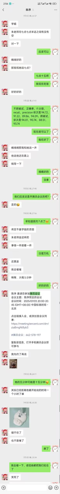

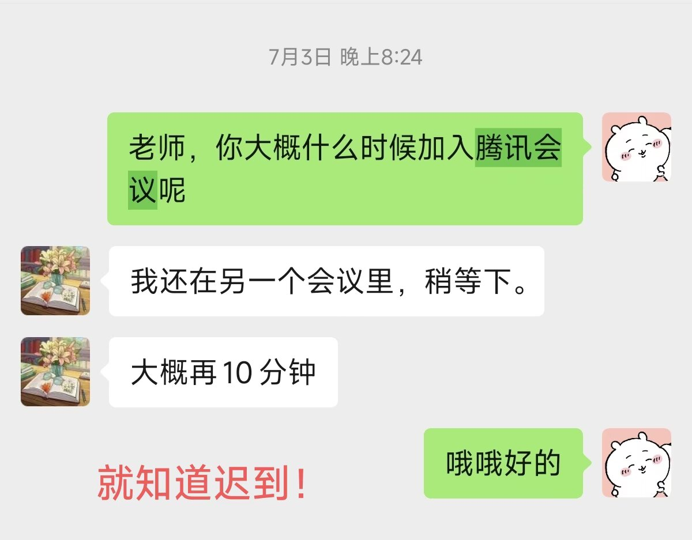

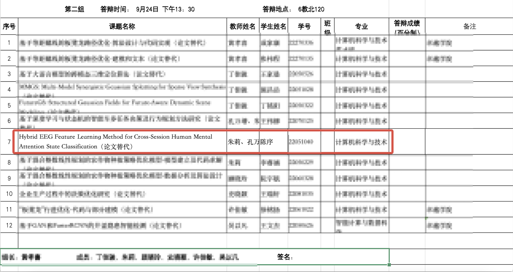

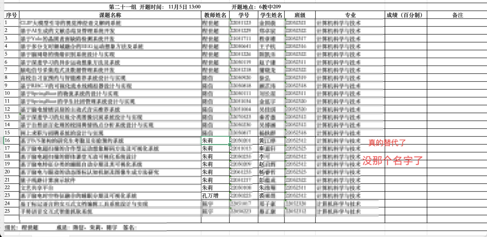

和我的毕业论文真像啊

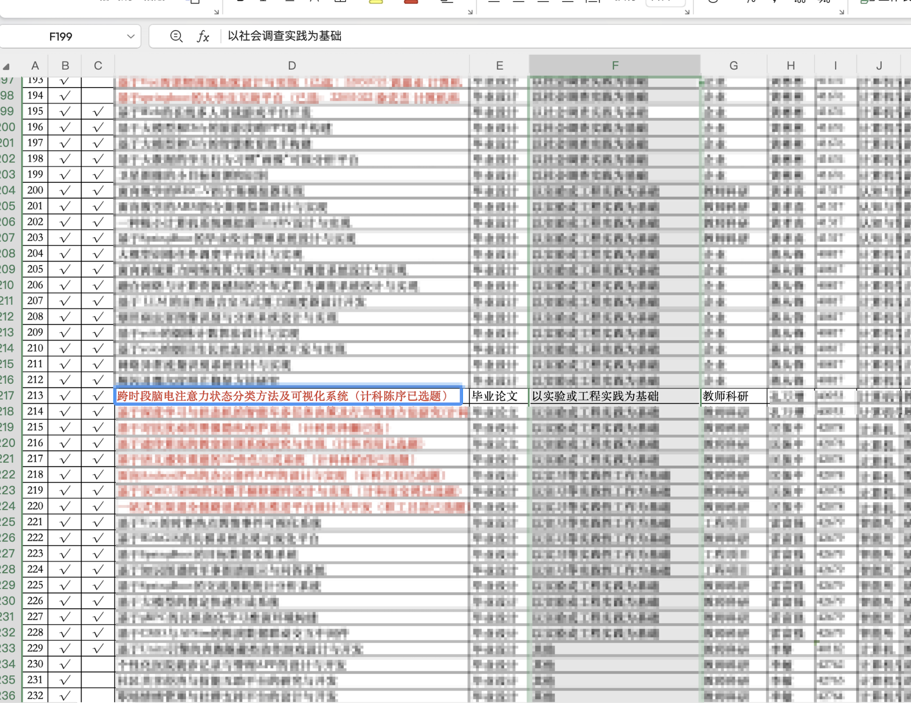

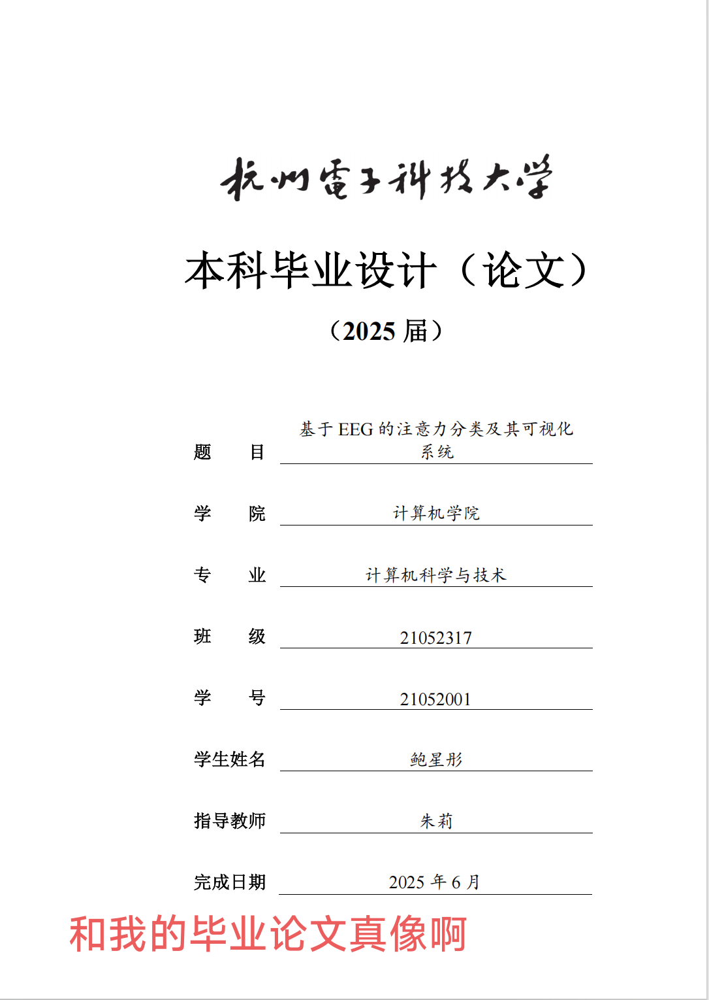

最后，也有人比较好奇，zl的硕士毕业院校，虽然我认为这件事情和学历、学校没有关系，但是学生在选导师前，借助公开信息推测导师的硕士毕业院校是合适的。

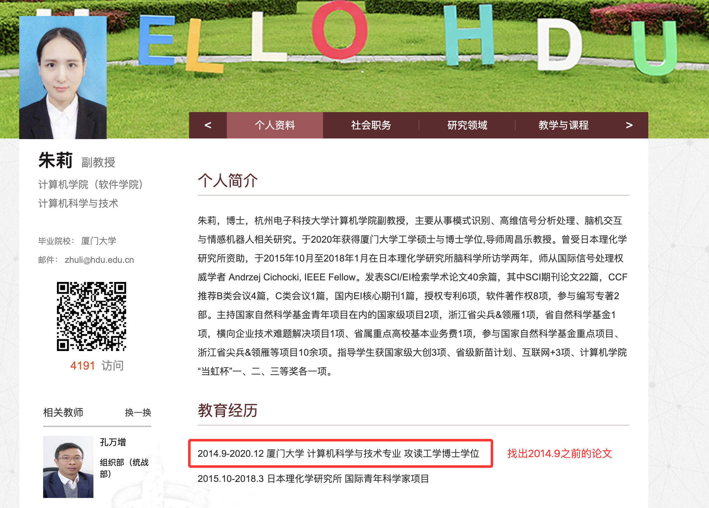

在google上建议搜 li zhu hangzhou dianzi，防止搜到重名的人

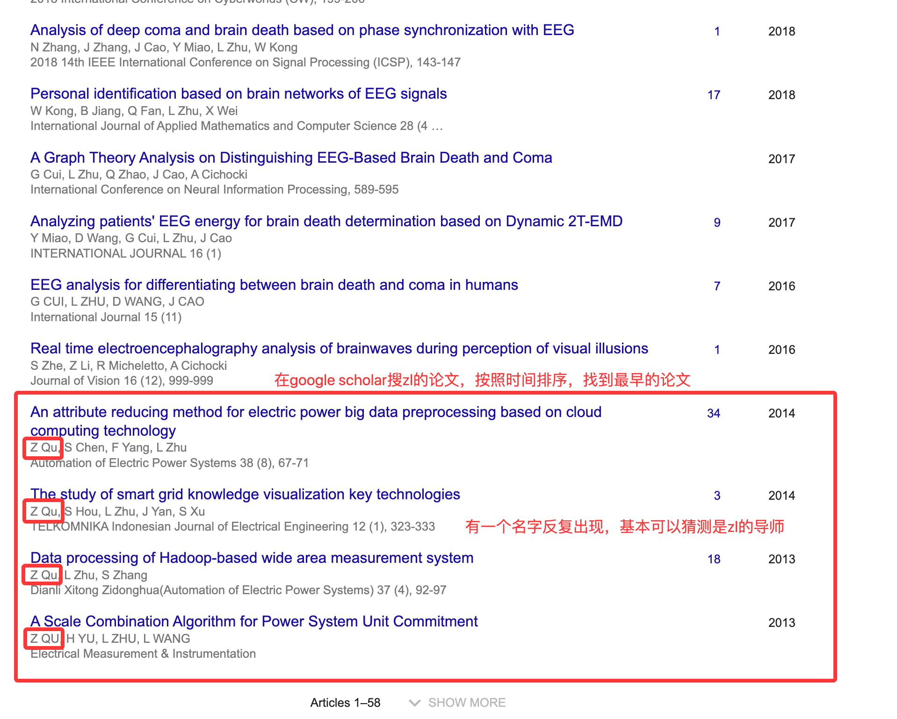

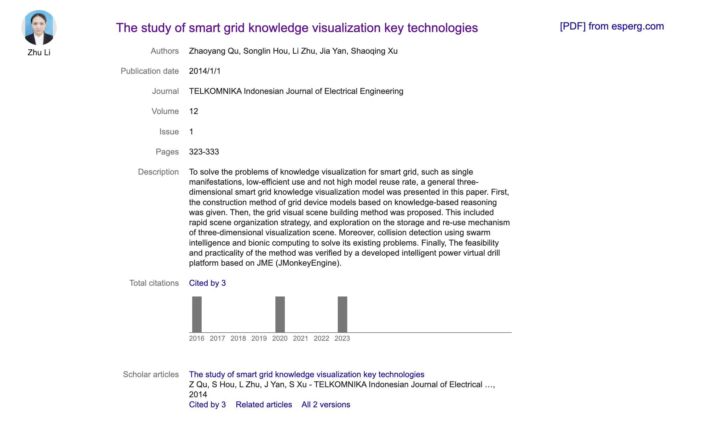

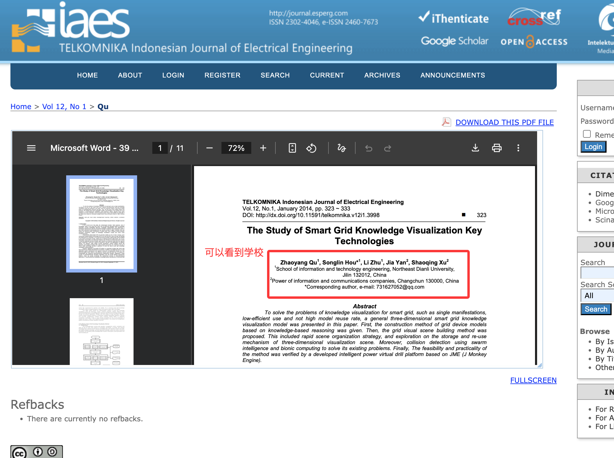

也可以搜到zl的硕导

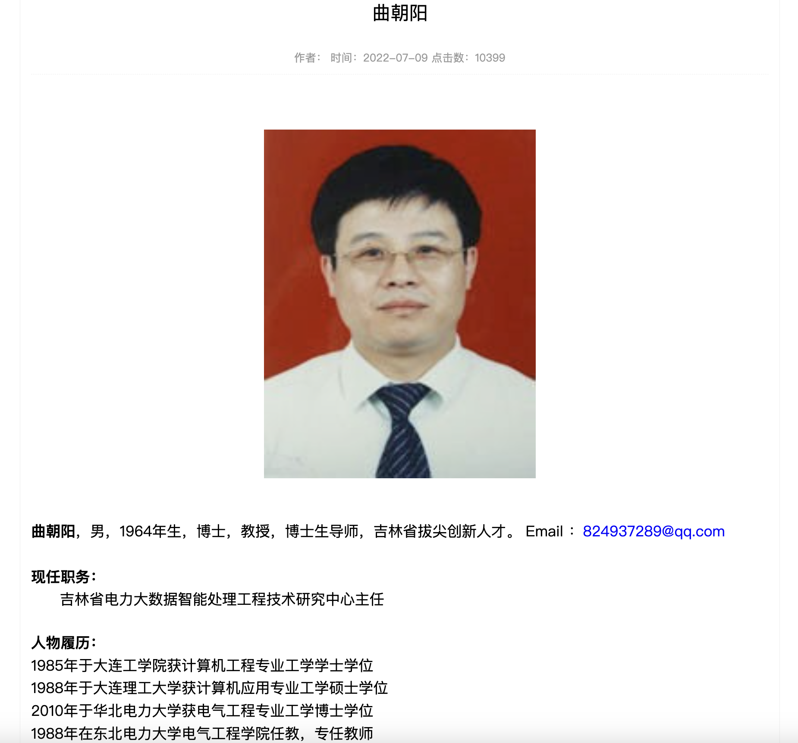
